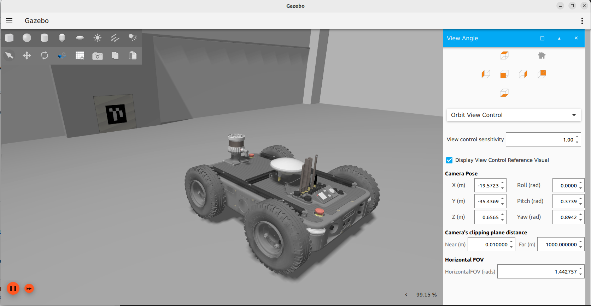

# Avular Origin simulation

This repository contains the simulation environment for the Avular Origin V1.0, using Gazebo Fortress and ROS2 Humble.

## Getting started

We currently support ROS2 Humble. For installing ROS2 Humble on your system, refer to the [ROS2 Humble installation guide](https://docs.ros.org/en/humble/Installation.html).
After making sure that ROS2 Humble is installed, install Gazebo Fortress on your system:

```
sudo apt update
sudo apt install ros-humble-ros-gz
```

To get started with the Avular Origin Simulation, clone this repository on your computer:
```
git clone --recursive git@github.com:avular-robotics/avular_origin_simulation.git
```

Next, enter the repository folder and build the packages in the workspace:
```
cd avular_origin_simulation
colcon build --symlink-install
```

You can now source the workspace (so ROS knows where to find the packages) and launch the simulation environment:
```
source install/setup.bash
ros2 launch origin_v10_gazebo ty_test_area.launch.py
```
This will show the avular simulation environment in Gazebo Fortress, with the Origin V1.0 spawned.
If you want to launch the simulation without sourcing each time, you can source the setup file in your bashrc:
```
echo "source <path_to_repo>/install/setup.bash" >> ~/.bashrc
```



## Driving and visualizing the robot in the simulation

The simulation contains gazebo plugins for the drive controller, the Ouster LiDAR and the realsense camera. To visualize the robot and its sensors, you can use the RViz visualization tool. To launch RViz with the correct configuration, run the following command:
```
ros2 launch origin_v10_description robot_visualization_rviz.launch.py
```

This will open RViz with the robot model and the sensor data. You can now drive the robot around in the simulation by publishing Twist messages to the `/robot/cmd_vel` topic. For example by using the `teleop_twist_keyboard` package:
```
sudo apt install ros-humble-teleop-twist-keyboard
ros2 run teleop_twist_keyboard teleop_twist_keyboard --ros-args -r /cmd_vel:=/robot/cmd_vel
```

